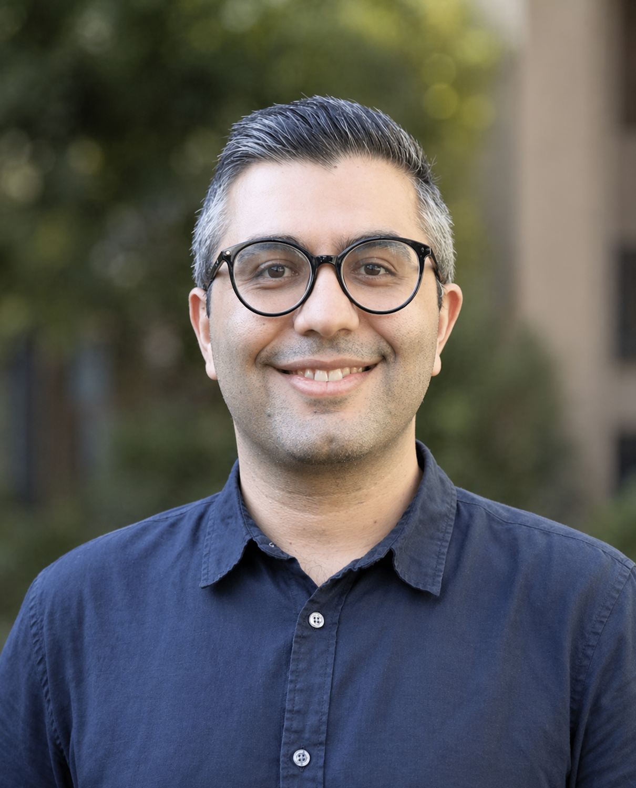

<!-- 
::: {.full-width}

::: {.grid .align-items-center}

::: {.g-col-12 .g-col-md-5}
{.img-fluid style="border-radius: 6px; width: 100%;"}
:::

::: {.g-col-12 .g-col-md-7 style="text-align: left; font-size: 1.1em; line-height: 1.6;"}
-->
I am a Lecturer at the [UNSW Institute for Climate Risk & Response (ICRR)](https://www.unsw.edu.au/research/icrr) at the [University of New South Wales (UNSW)](https://www.unsw.edu.au/staff/omid-ghasemi). I am a behavioural scientist studying how people reason, form beliefs, and make decisions in complex, real-world contexts.

My work focuses on judgment and decision-making, with applications in climate change, public policy, and science communication. I’m particularly interested in how people interpret information about risks and policies, how experiences shape beliefs, and why gaps often emerge between expert assessments and public perceptions.

I use behavioural experiments, large-scale surveys, and longitudinal data, often combined with real-world datasets, to better understand how people think and act outside the lab.
<!-- 
:::

:::

:::
-->