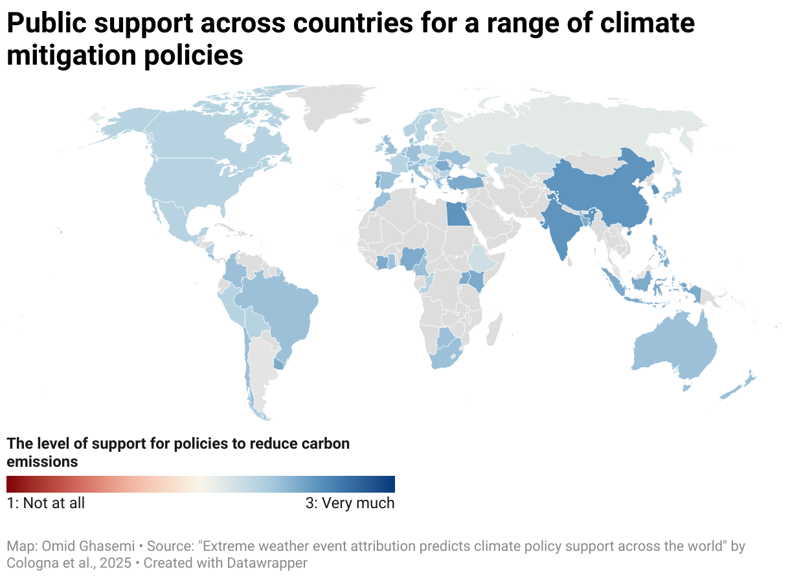
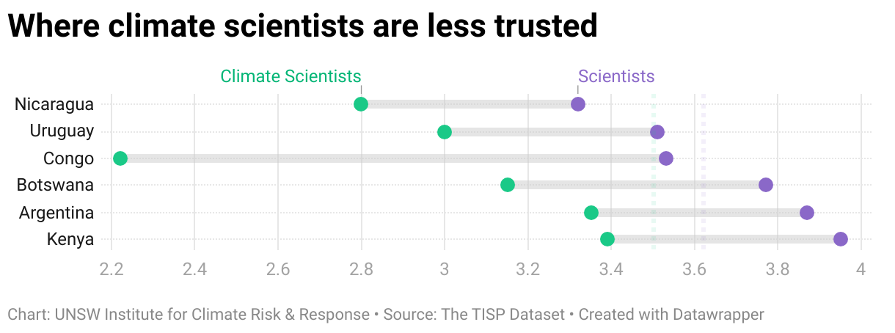
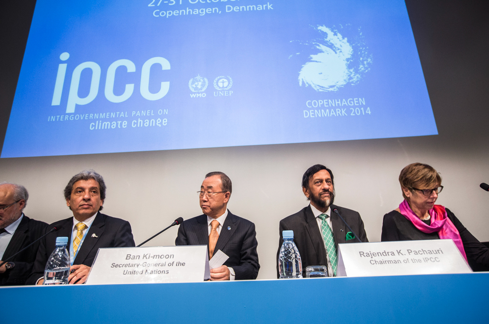

## <i class="bi bi-pencil-square"></i> Articles and commentary

::: {.grid}

::: {.g-col-12 .g-col-md-6 .g-col-lg-4}
::: media-card

### [Climate scientists are trusted globally, just not as much as other scientists – here’s why](https://theconversation.com/climate-scientists-are-trusted-globally-just-not-as-much-as-other-scientists-heres-why-256441){target="_blank"}

The Conversation  
May 2025
:::
:::

::: {.g-col-12 .g-col-md-6 .g-col-lg-4}
::: media-card

### [Experiencing extreme weather and disasters is not enough to change views on climate action](https://theconversation.com/experiencing-extreme-weather-and-disasters-is-not-enough-to-change-views-on-climate-action-study-shows-260308){target="_blank"}

The Conversation  
July 2025
:::
:::

:::

---

## <i class="bi bi-newspaper"></i> Media coverage of my research

::: {.grid}

::: {.g-col-12 .g-col-md-6 .g-col-lg-4}
::: media-card

### [How political discourse impacts on trust in science](https://connectsci.au/news/news-parent/2511/How-political-discourse-impacts-on-trust-in?searchresult=1){target="_blank"}
COSMOS Magazine  
July 2025
:::
:::

::: {.g-col-12 .g-col-md-6 .g-col-lg-4}
::: media-card

### [Does individual climate action distract from the big picture?](https://www.unsw.edu.au/newsroom/news/2025/10/individual-systemic-climate-action-research){target="_blank"}
UNSW Newsroom  
October 2025
:::
:::

::: {.g-col-12 .g-col-md-6 .g-col-lg-4}
::: media-card

### [Most people trust climate scientists less than other scientists – but not everywhere](https://news.unsw.edu.au/en/most-people-trust-climate-scientists-less-than-other-scientists-but-not-everywhere){target="_blank"}

UNSW Newsroom  
July 2025
:::
:::

::: {.g-col-12 .g-col-md-6 .g-col-lg-4}
::: media-card

### [People all over trust climate researchers less than scientists in general](https://www.science.org/content/article/people-all-over-trust-climate-researchers-less-scientists-general){target="_blank"}

Science  
November 2024
:::
:::

::: {.g-col-12 .g-col-md-6 .g-col-lg-4}
::: media-card

### [Reflecting on godly matters and on cognitive reasoning styles](https://featuredcontent.psychonomic.org/reflecting-on-godly-matters-and-on-cognitive-reasoning-styles/){target="_blank"}

Psychonomic Society  
June 2025
:::
:::

:::